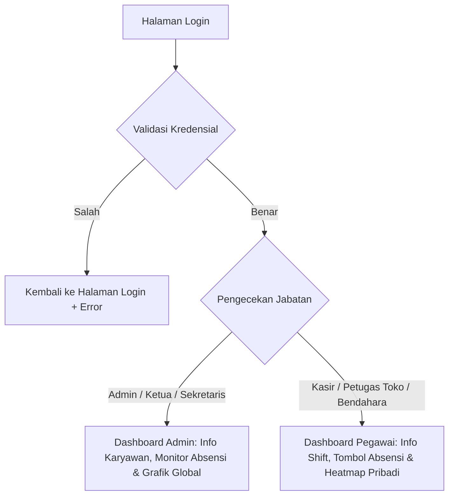

# 📚 BUKU PANDUAN PENGGUNA (ERP KOPDES)
### Sistem Informasi ERP Koperasi Desa Nasional

Buku panduan ini menjelaskan arsitektur alur kerja, pembagian tugas per peran (role), dan tata cara operasional untuk seluruh fitur utama di dalam sistem ERP Kopdes.

---

## 🔑 1. Alur Autentikasi & Login

Proses masuk (login) ke sistem dirancang terpusat dengan pembagian akses dinamis setelah autentikasi berhasil.



### Kredensial Login Demo
Semua akun demo menggunakan domain `@kopdes.id`. Detail lengkap kredensial dapat dilihat pada file [DAFTAR_PENGGUNA.md](file:///c:/xampp/htdocs/ERPKopdes/DAFTAR_PENGGUNA.md).

### 🛡️ Keamanan Tambahan: Google reCAPTCHA v2 (Invisible)
Setiap kali pengguna (untuk semua role) menekan tombol **"Masuk"** dengan kredensial yang valid, sistem akan memicu popup tantangan gambar secara otomatis dari **Google reCAPTCHA v2 (Invisible)**. 
Mekanisme ini berjalan dengan alur:
1. **Sisi Client (Browser):** Javascript memvalidasi form login terlebih dahulu. Jika form valid, script memanggil `grecaptcha.execute()` untuk memicu modal pop-up verifikasi gambar Google (memilih sepeda, hidran, dsb.).
2. **Callback Success:** Setelah tantangan diselesaikan secara benar oleh pengguna, callback `onSubmitCaptcha` akan dipicu untuk mengirimkan form ke server.
3. **Sisi Server (Laravel Controller):** Token respon divalidasi ke Google API (`https://www.google.com/recaptcha/api/siteverify`). Login sukses hanya jika API Google mengembalikan status sukses (`success: true`).

---

## 👥 2. Hak Akses & Tugas Per Peran (Role)

Sistem membagi pengguna ke dalam dua kelompok hak akses utama: **Administrator (Pengawas)** dan **Pegawai (Pelaksana)**.

| Fitur / Modul | Admin (`admin`) / Ketua (`ketua`) / Sekretaris (`sekretaris`) | Bendahara (`bendahara`) / Kasir (`kasir`) / Petugas Toko (`petugas_toko`) |
| :--- | :---: | :---: |
| **Peta Lokasi GPS (Maps)** | 🟢 Tampil Peta Detail & Koordinat Absensi | 🔴 Tersembunyi (Hanya deteksi background) |
| **Dashboard Heatmap** | 🔴 Tidak Tampil (Hanya memantau lewat Menu Laporan) | 🟢 Tampil Kalender Heatmap Kehadiran Sendiri |
| **Menu Manajemen Karyawan**| 🟢 Akses Penuh (Tambah, Edit, Nonaktifkan) | 🔴 Tidak Ada Akses (403) |
| **Manajemen & Jadwal Shift** | 🟢 Buat & Atur Shift / Jadwal Bulanan | 🔴 Hanya melihat jadwal hari ini di Dashboard |
| **Absen Harian (Form)** | 🔴 Tidak perlu absen (Menu disembunyikan) | 🟢 Wajib melakukan Absen Masuk & Pulang |
| **Persetujuan Izin / Cuti** | 🟢 Review & Proses Verifikasi permohonan | 🔴 Hanya mengajukan & melihat riwayat permohonan |

---

## 📍 3. Alur Kerja Modul Kehadiran (Absensi)

Modul absensi dirancang dengan proteksi keamanan tinggi guna mencegah kecurangan lokasi (seperti penggunaan VPN atau Fake GPS).

### A. Alur Absen Masuk (Pegawai)
1. Pegawai membuka menu **Absen Hari Ini**.
2. Sistem mendeteksi koordinat GPS secara senyap (*background geolocation*). 
   > [!NOTE]
   > Pegawai **tidak melihat peta map ataupun angka koordinat** pada layar mereka untuk menghindari manipulasi. Layar hanya menampilkan indikator: `✓ Lokasi berhasil terdeteksi`.
3. Pegawai membubuhkan tanda tangan digital pada panel *Signature Pad* yang tersedia.
4. Pegawai menekan tombol **Absen Masuk** (tombol ini terkunci otomatis sampai GPS terdeteksi).
5. Sistem mencatat waktu masuk dan melakukan kategori otomatis:
   - **Tepat Waktu**: Sesuai jam masuk shift + batas toleransi keterlambatan.
   - **Terlambat**: Masuk dalam kurun toleransi s.d 30 menit.
   - **Sangat Terlambat**: Terlambat lebih dari 30 menit dari jam mulai shift.

### B. Alur Absen Pulang (Pegawai)
1. Pegawai kembali ke halaman **Absen Hari Ini** setelah jam kerja berakhir.
2. Proses verifikasi GPS background berjalan seperti saat absen masuk.
3. Pegawai membubuhkan tanda tangan digital pulang, lalu menekan **Absen Pulang**.
4. Sistem menghitung durasi kerja secara otomatis.

### C. Alur Monitoring & Verifikasi (Admin)
1. Admin masuk ke menu **Monitor Absensi**.
2. Admin mengklik **Detail** pada salah satu rekaman kehadiran pegawai.
3. Admin dapat:
   - Memeriksa keabsahan tanda tangan masuk & pulang.
   - **Melihat Peta Peta Geolocation (Leaflet Maps)** yang secara akurat menampilkan koordinat presisi di mana pegawai tersebut menekan tombol absen.
   - Mengubah status verifikasi kehadiran menjadi **Terverifikasi** atau **Ditolak**.

---

## 📅 4. Kalender Kehadiran & Heatmap (Pegawai)

Di halaman dashboard pegawai, terdapat widget **Kehadiran Bulan Ini** berbentuk heatmap kalender.

```
Status Warna Heatmap:
🟩 Hijau      : Hadir Tepat Waktu
🟨 Kuning     : Hadir dengan status Terlambat/Sangat Terlambat
🟥 Merah      : Alpa (Hari kerja lewat tanpa ada catatan absen masuk)
⬜ Abu-abu    : Hari Libur (Sabtu & Minggu) / Hari yang belum berjalan
```

> [!IMPORTANT]
> - Kalender ini bersifat **pribadi (per-user)**. Karyawan yang baru pertama kali terdaftar akan melihat kalender dalam keadaan bersih/kosong tanpa data milik orang lain.
> - Data absensi aktual pada hari libur (misalnya masuk lembur pada hari Sabtu/Minggu) akan secara otomatis memperbarui warna kalender menjadi hijau/kuning sesuai waktu absen nyata, bukan sekadar abu-abu.

---

## ✉️ 5. Alur Pengajuan Izin & Cuti

Jika pegawai berhalangan hadir (Sakit atau Izin Keperluan Lain):
1. **Pengajuan (Pegawai):** 
   - Pegawai masuk ke menu **Izin & Cuti** lalu mengisi form pengajuan (tanggal mulai, selesai, alasan, dan bukti/lampiran).
2. **Notifikasi (Admin):** 
   - Dashboard Admin akan menampilkan pemberitahuan permohonan tertunda (*pending*) pada bagian bawah ringkasan.
3. **Persetujuan (Admin):** 
   - Admin meninjau berkas alasan dan memutuskan untuk menyetujui (*Approve*) atau menolak permohonan tersebut. Setelah disetujui, hari kerja yang diajukan otomatis tercatat sebagai "Izin/Sakit" di laporan akhir.

Format CSV VALID
Alyzza Nazwa, alyzza@gmail.com, alyzza123,petugas_toko,aktif,KD-2025-009,0203320092233,098726378881,P,Ciamis,2009-02-23,Islam,"Jl. Melati No. 5","Kopdes Dago"
csv valid
